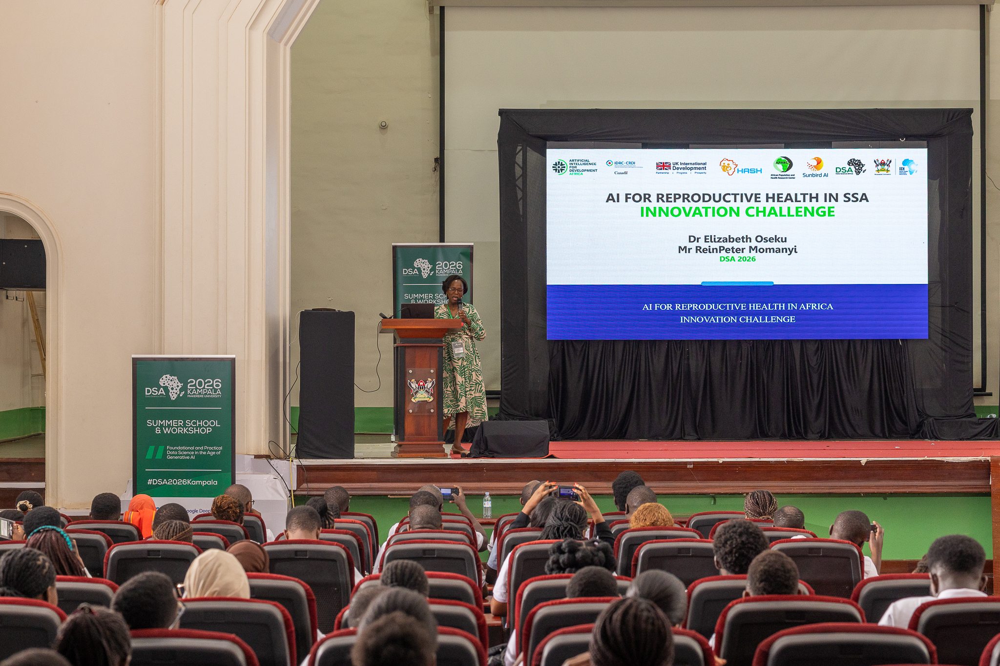
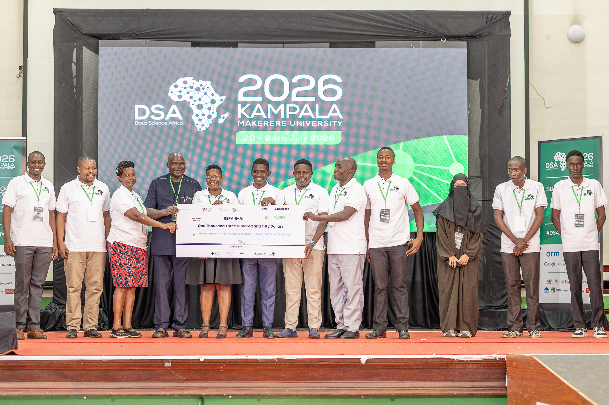
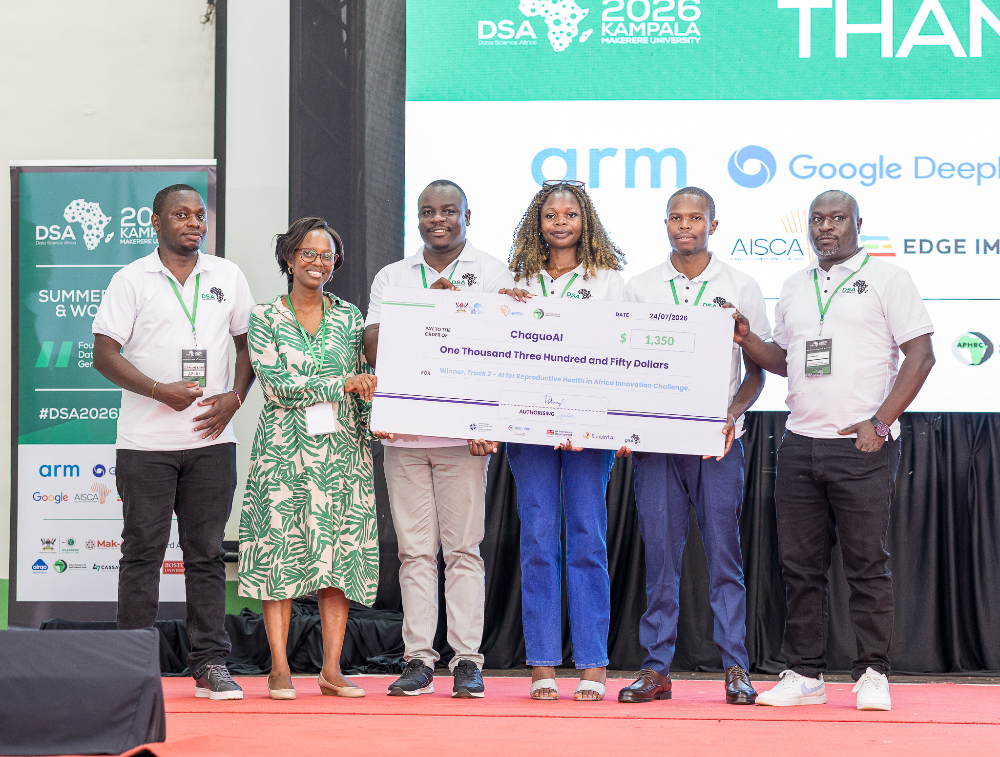

```{r setup, results="hide", include=FALSE}

## Set Chunk requirements
knitr::opts_chunk$set(#include = TRUE,
                      echo=FALSE, message = FALSE, warning = FALSE, dpi = 300,
                      fig.height=8.5, fig.width=10.5, out.height="110%", out.width="100%"
                      )

```

```{r setting working directory, include=FALSE, results = "hide"}

## Setting work directory

working_directory <- base::getwd()

ggtheme_descriptive_plot()

```

\newpage

# **Submission**

## Submission criteria

The innovation challenge sprint span for four weeks from `r format(as.Date("11/05/2026", format = "%d/%m/%Y"),"%d %B %Y")` to `r format(as.Date("6/06/2026", format = "%d/%m/%Y"),"%d %B %Y")`. To ensure a fair, transparent, and consistent process for evaluating the prototypes developed by participating teams, a standardized set of submission criteria was developed and applied across all submissions. The criteria provided clear guidance on the expected assessment documentation requirements, enabling teams to align their prototype development efforts with the challenge objectives while facilitating an objective and comparable review process by evaluators.

Table 1 presents the standardized submission criteria that were shared with all participating teams. These criteria outlined the required deliverables, documentation, and evaluation requirements for prototype submission, ensuring consistency in the information provided and supporting a fair and transparent assessment process across all teams.

```{r, tab.cap = "Table 1: Prototype Submission criteria"}
### Statement of Interest Evaluation Criteria
tab_1_sub <- df_raw_submission_prototype_criteria

tab_1_sub %>%
  flextable::as_flextable(show_coltype = FALSE
                          , max_row = nrow(df_raw_submission_prototype_criteria)
                          , short_strings = FALSE
                          ) %>%
  #flextable::autofit() %>%
  flextable::fit_to_width(max_width = 8) %>%
  flextable::set_table_properties(layout = 'autofit'
                                  , align = 'center'
                                  )
```


## Team submissions

All prototype submissions were required to be submitted by `r format(as.POSIXct(paste(as.Date("6/06/2026", format = "%d/%m/%Y"), "23:59:59"), tz = "Africa/Nairobi"), "%d %B %Y %H:%M:%S %Z")`. This deadline marked the conclusion of the four-week Innovation Challenge Sprint and ensured that all teams were assessed within a common submission window. A total of `r sum(df_raw_submission_teams$confirmed_submission %in% c("yes"), na.rm = TRUE)` out of the `r nrow(df_raw_submission_teams)` participating teams successfully submitted their prototypes by the stipulated deadline, representing an overall submission rate of `r round(100 * sum(df_raw_submission_teams$confirmed_submission %in% c("yes"), na.rm = TRUE) / nrow(df_raw_submission_teams), 1)`%. These submissions were subsequently reviewed and assessed using a standardized evaluation criteria established for the Innovation Challenge Sprint.

Of the `r sum(df_raw_submission_teams$confirmed_submission %in% c("yes"), na.rm = TRUE)` prototype submissions received, `r sum(!is.na(df_raw_submission_teams$confirmed_submission) & df_raw_submission_teams$confirmed_submission == "yes" & df_raw_submission_teams$innovation_challenge_track == "Track I: Access to Comprehensive Early Pregnancy Loss Care")` were from Track I: Access to Comprehensive Early Pregnancy Loss Care and `r sum(!is.na(df_raw_submission_teams$confirmed_submission) & df_raw_submission_teams$confirmed_submission == "yes" & df_raw_submission_teams$innovation_challenge_track == "Track II: Empowering Informed Decision-Making for Contraception")` were from Track II: Empowering Informed Decision-Making for Contraception. This represents submission rates of `r paste0(round(100 * sum(!is.na(df_raw_submission_teams$confirmed_submission) & df_raw_submission_teams$confirmed_submission == "yes" & df_raw_submission_teams$innovation_challenge_track == "Track I: Access to Comprehensive Early Pregnancy Loss Care") / sum(df_raw_submission_teams$innovation_challenge_track %in% c("Track I: Access to Comprehensive Early Pregnancy Loss Care"), na.rm = TRUE), 1), "% ", "(", sum(!is.na(df_raw_submission_teams$confirmed_submission) & df_raw_submission_teams$confirmed_submission == "yes" & df_raw_submission_teams$innovation_challenge_track == "Track I: Access to Comprehensive Early Pregnancy Loss Care"), "/",sum(df_raw_submission_teams$innovation_challenge_track %in% c("Track I: Access to Comprehensive Early Pregnancy Loss Care"), na.rm = TRUE),")")` and `r paste0(round(100 * sum(!is.na(df_raw_submission_teams$confirmed_submission) & df_raw_submission_teams$confirmed_submission == "yes" & df_raw_submission_teams$innovation_challenge_track == "Track II: Empowering Informed Decision-Making for Contraception") / sum(df_raw_submission_teams$innovation_challenge_track %in% c("Track II: Empowering Informed Decision-Making for Contraception"), na.rm = TRUE), 1), "% ", "(", sum(!is.na(df_raw_submission_teams$confirmed_submission) & df_raw_submission_teams$confirmed_submission == "yes" & df_raw_submission_teams$innovation_challenge_track == "Track II: Empowering Informed Decision-Making for Contraception"), "/",sum(df_raw_submission_teams$innovation_challenge_track %in% c("Track II: Empowering Informed Decision-Making for Contraception"), na.rm = TRUE),")")` for Track 1 and Track II, respectively.

# **Review of Prototypes**

## Reviewer Team

The prototype review team was composed of `r sum(!df_raw_evaluators_list$evaluator == "Judge", na.rm = TRUE)` multidisciplinary experts with experience in data science, software architecture, full-stack software development, software engineering, artificial intelligence, machine learning engineering, AI engineering, data anonymization, computer networks, computer security, network monitoring, deep learning technologies, and health informatics, reproductive and maternal health, public health, research, and innovation. The diverse expertise of the review panel ensured a comprehensive assessment of submissions across technical, clinical, ethical, and implementation dimensions.

`r sum(!df_raw_evaluators_list$evaluator == "Reviewer - Track 1", na.rm = TRUE)` reviewers evaluated the prototype submissions for Track I while `r sum(!df_raw_evaluators_list$evaluator == "Reviewer - Track 2", na.rm = TRUE)` reviewed Track II.


## Review process

The prototype reviews were done between `r format(as.Date("08/06/2026", format = "%d/%m/%Y"),"%d %B %Y")` and `r format(as.Date("10/06/2026", format = "%d/%m/%Y"),"%d %B %Y")`. The screening process assessed submitted prototypes against a standardized set of criteria designed to evaluate the technical quality, relevance, feasibility, ethical considerations, and reproducibility of each solution. The evaluation assesed:

1. Submission of a functional prototype or proof-of-concept. Acceptable formats included web applications, mobile applications, conversational AI chatbots, decision-support systems, machine learning models, data analytics dashboards, prototype demonstrations, and other AI-enabled digital health tools.
2. clarity and relevance of their problem statement, including the selected challenge track, the reproductive health problem being addressed, the intended target users and beneficiaries, and the relevance of the proposed solution to Sub-Saharan African contexts.
3. The description of the proposed innovation, its key functionalities, user workflow, and anticipated benefits to health systems. Evaluators also reviewed the technical approach, including the artificial intelligence and machine learning methods employed, algorithms and models implemented, system architecture, data processing pipelines, and model evaluation methodologies.
4. Ethical and responsible AI considerations. Teams were required to demonstrate how their solutions addressed data privacy, protection, and security; mitigated bias and fairness concerns; incorporated transparency and explainability mechanisms; complied with applicable legal and regulatory requirements; and adhered to relevant ethical standards.
4. Scalability and sustainability of each solution, including deployment strategies, resource requirements, integration with existing health systems, and long-term maintenance considerations. Particular attention was given to data use and documentation, including the utilization of DASSA challenge datasets, integration of public or externally sourced datasets, data cleaning procedures, feature engineering methods, data quality assurance processes, and evidence of appropriate data permissions and licensing.
5. Open science and reproducibility, where teams were required to provide access to source code repositories, installation instructions, dependency specifications, environment configuration files, and documentation necessary to reproduce results. Teams were also required to clarify ownership of submitted work.
6. team contributions and collaboration, assessing the extent of technical development, data science and analytics expertise, clinical or public health input, project management, and user experience design within each team.

For each submission, reviewers independently assessed each prototype against the standardized evaluation criteria and documented feedback on key strengths, areas for improvement, and an overall recommendation. The screening outcomes informed the selection of high-potential solution prototypes.

# **Presentation of Prototypes**

Prototype presentations for Track I (Access to Comprehensive Early Pregnancy Loss Care) were conducted on `r format(as.Date("11/06/2026", format = "%d/%m/%Y"),"%d %B %Y")`, while presentations for Track II were held on `r format(as.Date("20/06/2026", format = "%d/%m/%Y"),"%d %B %Y")`. During these sessions, participating teams showcased their solutions, demonstrated key functionalities of their prototypes, and responded to questions from the evaluation panel. The presentations provided an opportunity for reviewers to assess the practical implementation, usability, innovation, and potential impact of the proposed solutions beyond the information submitted during the review phase.

For both presentation sessions, the prototypes were evaluated by a panel of `r sum(!is.na(df_raw_evaluators_list$email_confirmation) & df_raw_evaluators_list$email_confirmation == "yes" & df_raw_evaluators_list$evaluator == "Judge")` judges and the respective assigned reviewers for each track (`r sum(!df_raw_evaluators_list$evaluator == "Reviewer - Track 1", na.rm = TRUE)` for Track I while `r sum(!df_raw_evaluators_list$evaluator == "Reviewer - Track 2", na.rm = TRUE)` for Track II). The judging panel comprised experts with complementary expertise in data science, artificial intelligence, data management, data documentation, epidemiology, and public health research. Collectively, the judges brought a balanced combination of technical, analytical, artificial intelligence, data governance, and public health expertise, enabling a comprehensive assessment of the submitted prototypes and their potential contribution to improving reproductive and maternal health outcomes in Sub-Saharan Africa.

The judges and reviewers assessed each team's presentation, prototype functionality, innovation, technical feasibility, relevance to the challenge objectives, and potential for scalability and impact. The panel also engaged teams through question-and-answer sessions to gain a deeper understanding of the proposed solutions, their implementation approaches, and their readiness for deployment in real-world settings.

To ensure a fair, transparent, and consistent assessment process across all prototype presentations, a standardized scoring rubric was developed and utilized by all Judges. The rubric provided uniform assessment across seven criteria, enabling objective scoring. Table 2 presents the scoring criteria and the corresponding weights assigned to each criterion within the assessment rubric. The weighting system was designed to reflect the relative importance of each evaluation domain, with a cumulative weighted score totaling to 100%.

```{r, tab.cap = "Table 2: Prototype Presentation Evaluation Criteria"}
### Prototype Presentation Evaluation Criteria
tab_2_sub <- df_raw_evaluation_criteria

tab_2_sub %>%
  flextable::as_flextable(show_coltype = FALSE
                          , max_row = 15
                          , short_strings = FALSE
                          ) %>%
  #flextable::autofit() %>%
  flextable::fit_to_width(max_width = 8) %>%
  flextable::set_table_properties(layout = 'autofit'
                                  , align = 'center'
                                  )
```

All criteria were scored on a 4-point performance scale as shown in Table 5.

```{r, tab.cap = "Table 3: Prototype Presentation Scoring Scale"}
### Prototype Presentation Scoring Scale
tab_3_sub <- df_raw_evaluation_scoring_scale

tab_3_sub %>%
  flextable::as_flextable(show_coltype = FALSE
                          , max_row = 15
                          , short_strings = FALSE
                          ) %>%
  #flextable::autofit() %>%
  flextable::fit_to_width(max_width = 8) %>%
  flextable::set_table_properties(layout = 'autofit'
                                  , align = 'center'
                                  )


```

After scoring all criteria, the raw scores (1–5) were then multiplied by the weighting factor to obtain the weighted score, and then summed up to obtain the final score out of 100. Table 4 presents the weighting score summary.

```{r, tab.cap = "Table 4: Weighted Score Summary Sheet"}
### Weighted Score Summary Sheet
tab_4_sub <- df_raw_evaluation_weight_scoring

tab_4_sub %>%
  flextable::as_flextable(show_coltype = FALSE
                          , max_row = 15
                          , short_strings = FALSE
                          ) %>%
  #flextable::autofit() %>%
  flextable::fit_to_width(max_width = 8) %>%
  flextable::set_table_properties(layout = 'autofit'
                                  , align = 'center'
                                  ) %>%
  flextable::colformat_char(na_str = "") %>%
  flextable::colformat_double(na_str = "")

```


Following the final prototype presentations and judging process, total weighted scores (out of 100) were ranked from highest to lowest within each track. REPAIR-AI emerged as the top-performing solution in Track I. In Track II, ChaguoAI was selected as the top-performing solution. Table 5 presents the teams scores per Track.

```{r, tab.cap = "Table 5: Prototype Presentation Scores"}
### Weighted Score Summary Sheet
tab_5_sub <- df_raw_final_evaluation_list

tab_5_sub %>%
  flextable::as_flextable(show_coltype = FALSE
                          , max_row = nrow(df_raw_final_evaluation_list)
                          , short_strings = FALSE
                          ) %>%
  #flextable::autofit() %>%
  flextable::fit_to_width(max_width = 8) %>%
  flextable::set_table_properties(layout = 'autofit'
                                  , align = 'center'
                                  ) %>%
  flextable::colformat_char(na_str = "") %>%
  flextable::colformat_double(na_str = "")

```

# **Award of Winning Teams**

The winning teams from each challenge track were awarded prize money of **USD 1,350 each** in recognition of their outstanding performance and innovative solutions. The awards were presented during the **DSA Workshop held at Makerere University, Uganda**, on `r format(as.Date("24/07/2026", format = "%d/%m/%Y"),"%d %B %Y")`. The award ceremony provided an opportunity to showcase the achievements of the Innovation Challenge participants and celebrate the development of AI-enabled solutions addressing reproductive and maternal health challenges in Sub-Saharan Africa.

REPAIR-AI, the winning team from Track I: Access to Comprehensive Early Pregnancy Loss Care, and ChaguoAI, the winning team from Track II, received the awards following their successful prototype demonstrations and top rankings in the final evaluations.






